# holding-manager-app

### 1. Description
Holding manager app is a program to manage employees, employee's contracts, branch offices, and companies from a fictional holding called Seros Group. It also allows to create reports about all of them in different formats such as CSV, txt and in screen. It also saves the information using txt files and class serialization. In addition, it uses various programming aspects in java as binary search trees, linked list, heritage, interfaces and features a GUI made using JavaFX 8.

### 2. Problem Analysis
Problem design, first functional requirements, and mockups. It can be found [here](docs/development).

### 3. Solution Design
Final functional requierements, non functional requirements, class diagrams and test designs. Can be found [here](docs/development).

### 4. Demonstration video
Video showing problem analysis, solution design and functioning program. Youtube video [here](https://youtu.be/ySSoOTYQzM0).

### 5. Program Screenshots
Some screenshots of the program:

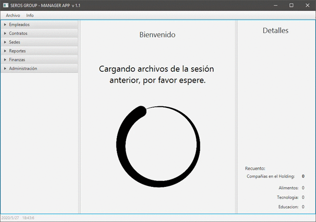
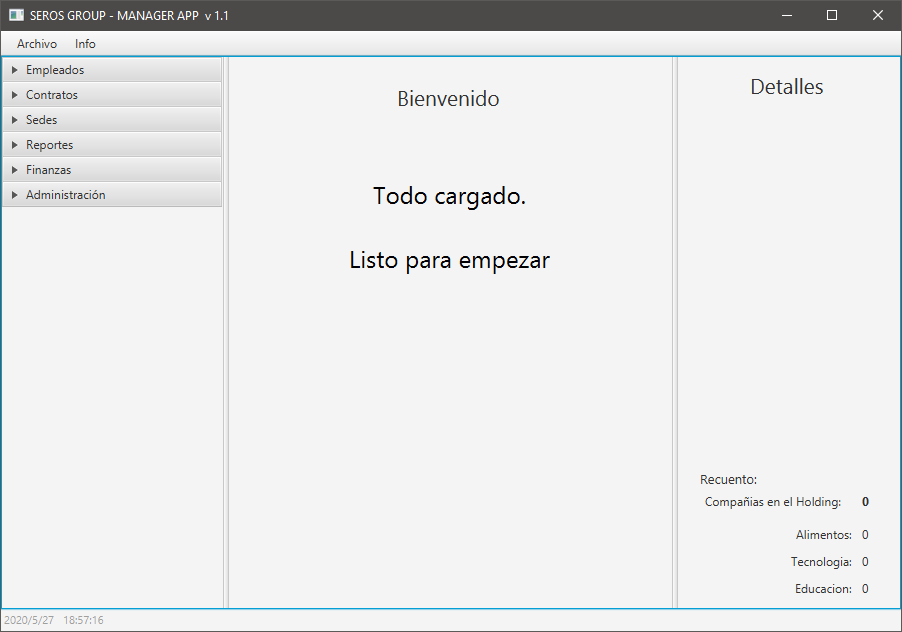
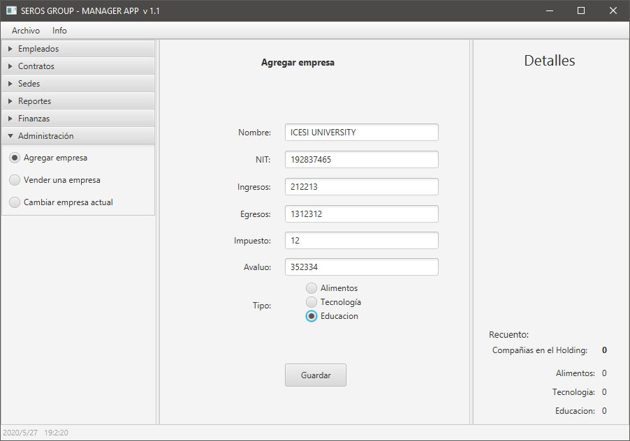
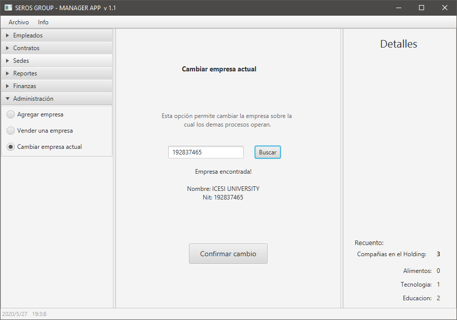
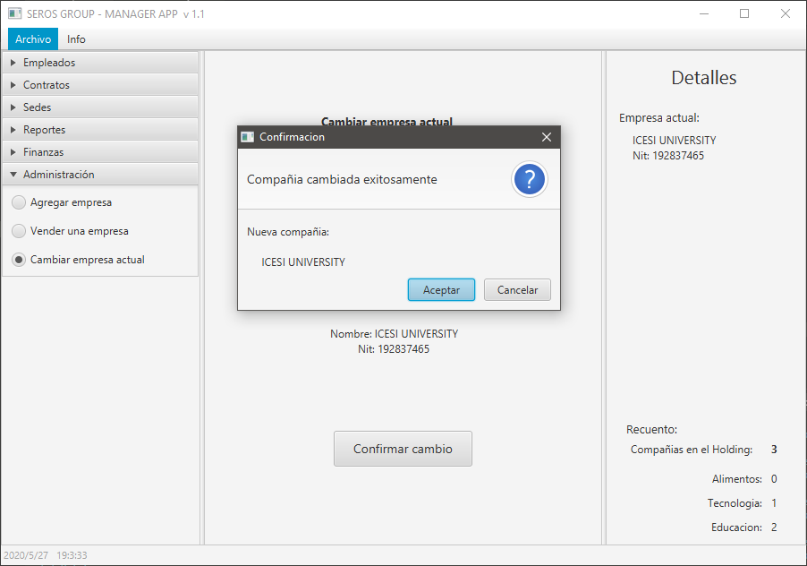
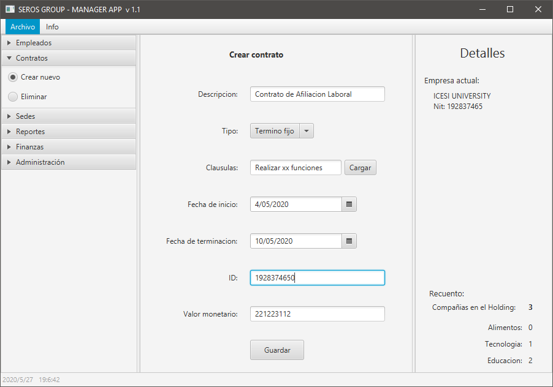
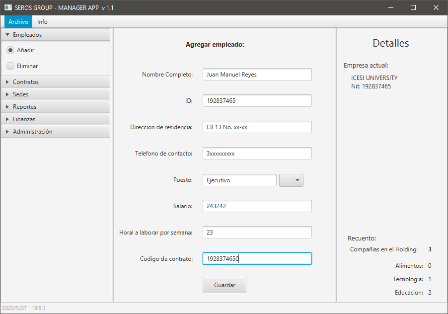
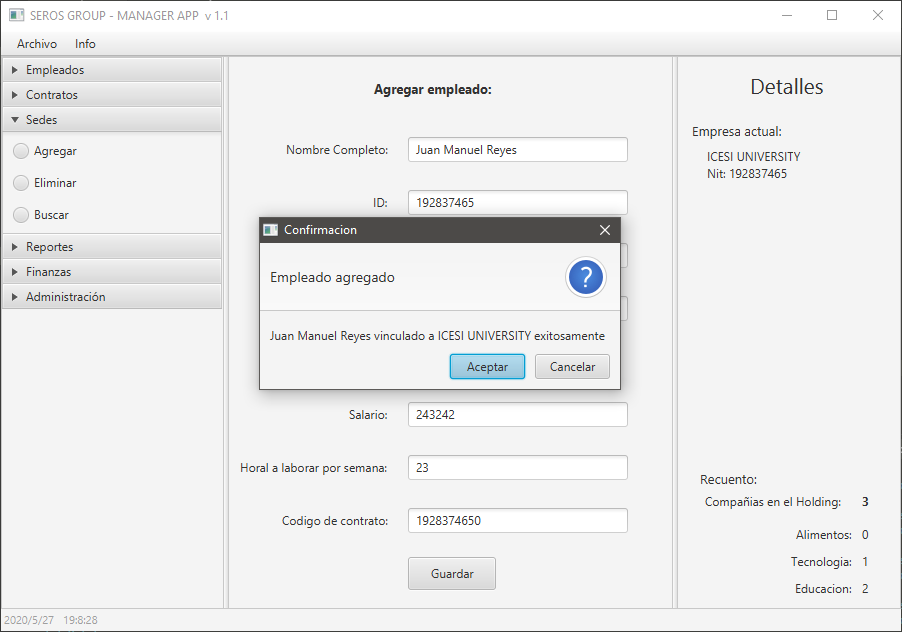
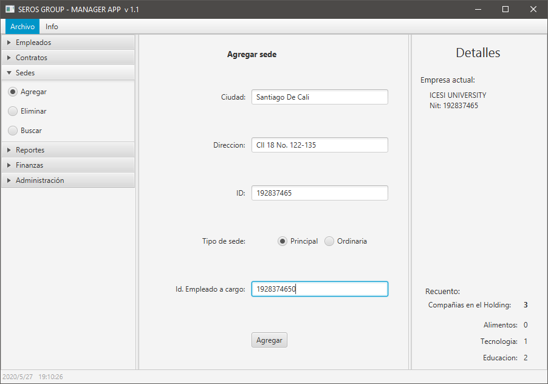
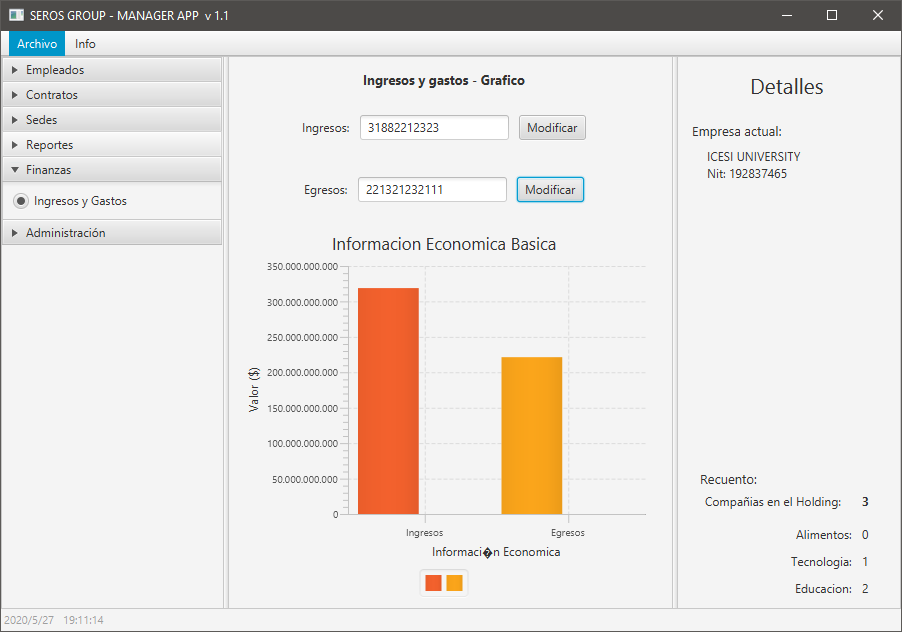
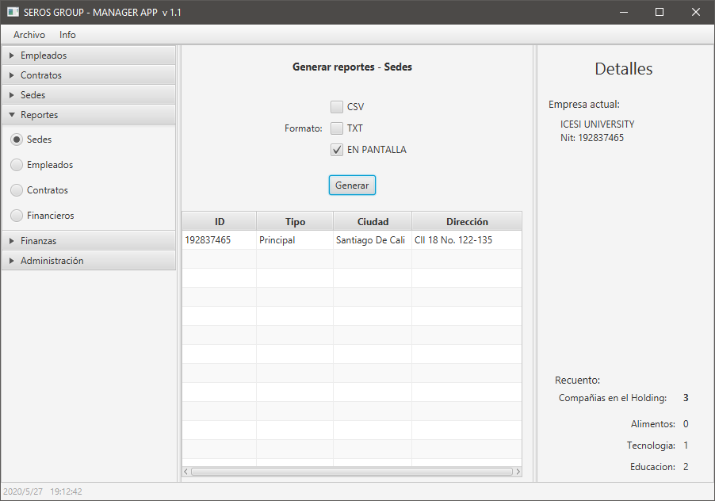

### 6. Developers
- https://github.com/kamneklogs
- https://github.com/JuanF2019
